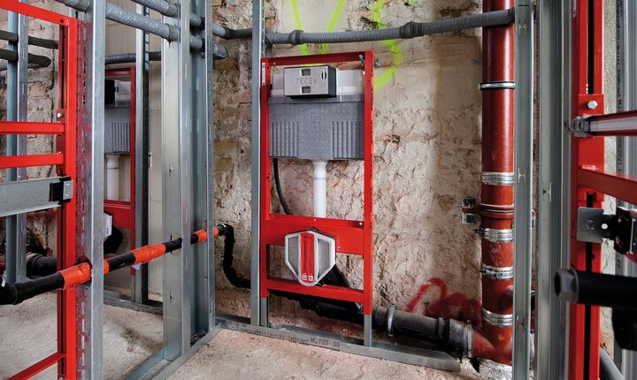

# Das Traumbad nach Maß: Schnell und sauber

Der Wunsch nach einem neuen Badezimmer wird oft von der Sorge ausgebremst, das Haus dadurch für Wochen zur Baustelle zu machen. Die Vorstellung von Stemmarbeiten, Staub und Schutt lassen das Verlangen nach zeitgemäßem Badespaß schnell zum Albtraum werden. Ängste, die unbegründet sind, denn die Zeiten, in denen Fliesen abgestemmt und Rohre buchstäblich aus der Wand gerissen wurden, sind längst vorbei.

## Die Technik der Vorwandinstallation
Die Badprofis von heute lassen das neue Traumbad mit der Technik der so genannten **Vorwandinstallation** entstehen. Wie die Bezeichnung schon vermuten lässt, wird dabei vor der alten Wand eine neue aufgebaut, hinter der dann die Rohre verschwinden.

*   Die alten Leitungen bleiben in der Wand (totgelegt).
*   Alte Fliesen müssen nicht weichen, sie werden verdeckt.
*   Stabiles Ständerwerk für Sanitärobjekte.
*   Beplankung mit speziellen Paneelplatten.

Maurerarbeiten sind folglich nicht nötig und der Fliesenleger findet eine Oberfläche, auf der direkt gefliest werden kann.

## Gestaltungsvielfalt
Die Technik der Vorwandinstallation erweist sich somit nicht nur als sauber und kostengünstig, weil schnell realisierbar, sondern auch als Möglichkeit, besondere Gestaltungswünsche zu erfüllen. Da die Elemente der Unterkonstruktion auch eigenständig aufgebaut werden können, sind halbhohe Raumteiler oder sogar Trennwände im Handumdrehen Wirklichkeit im Bad. Wir haben hier sehr viele Ideen für das Bad mit Pfiff im Griff.
