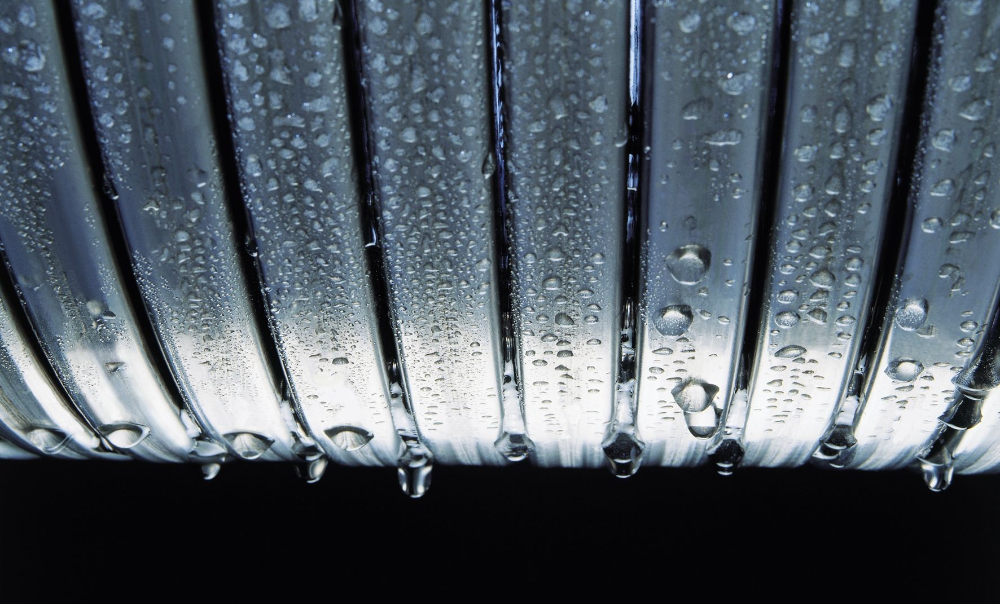

# Brennstoff-Energie optimal nutzen
Je weniger Wärme mit den Abgasen buchstäblich durch den Schornstein verloren geht, desto mehr Energie holt der Heizkessel aus dem Erdgas oder aus dem Heizöl heraus. Das bedeutet, dass weniger Brennstoff nötig ist, um die gewünschte Raumwärme und Warmwassertemperatur zu erreichen. Weniger Brennstoffverbrauch bedeutet Heizkostenersparnis. Und: Wird weniger Gas oder Öl verbrannt, entstehen weniger Abgase – und das schützt die Umwelt.

## Doppelte Einsparung
Möglich wird diese doppelte Einsparung durch die moderne **Brennwerttechnik**. Sie holt buchstäblich schon verlorene Energie zurück. Denn bei jeder Verbrennung entsteht Wasserdampf. Bei der Brennwerttechnik geben die Abgase ihre Wärme über spezielle Wärmetauscher an das Heizungswasser ab. Dabei werden die Abgase so weit ausgekühlt, dass der Wasserdampf kondensiert und wieder zu Wasser wird.

Bei diesem Vorgang wird die Energie wieder frei, die während der Verbrennung zur Verdampfung des Wasserdampfes benötigt wurde. Bei der Öl-Brennwerttechnik bedeutet das zum Beispiel einen Energiegewinn von rund sechs Prozent.
## Auch ohne Kondensation effizient
Und selbst dann, wenn der Taupunkt nicht unterschritten wird, es also nicht zur Kondensation des Wasserdampfes kommt, erreicht man durch die hochwirksamen Wärmetauscherflächen immerhin noch gut fünf Prozent mehr „Energieausbeute“, verglichen mit herkömmlichen Heizkesseln. Ein Betrieb ohne Kondensation ist in bestimmten Betriebssituationen zu erwarten (z. B. im Winter, wenn eine Heizungsanlage mit Heizkörpern eine höhere Wassertemperatur benötigt). Aber auch in dieser Situation rechnet sich – wie gesagt – ein Brennwert-Heizkessel.

Wir als Meisterbetrieb können Auskunft darüber geben, wie effizient diese Technik bei den verschiedenen Heizungsanlagen eingesetzt werden kann – ein Beratungsgespräch, das sich in jeder Hinsicht lohnt.
