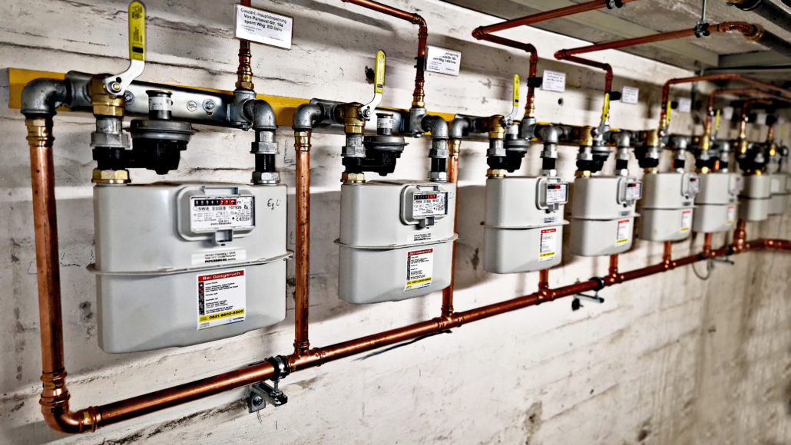

# Gasleitungen im Haus: Alle 12 Jahre unter der Lupe

Moderne Installationstechniken und geprüftes Material machen die Gasrohre im Haus zuverlässig und sicher. Aber so wie auch Häuser an sich älter werden, unterliegen auch diese Leitungen einem natürlichen Verschleiß. Hier ist es wie beim Auto: Werden kleine Mängel rechtzeitig entdeckt, sind diese auch problemlos zu beseitigen.

## DVGW Vorschriften
Basierend auf jahrzehntelangen Praxiserfahrungen hat der Deutsche Verein des Gas- und Wasserfaches (DVGW) mit der Neufassung der Technischen Regeln für Gas-Installationen festgelegt, dass Gasrohre im Haus **alle 12 Jahre durch einen zugelassenen Fachmann überprüft werden müssen**.

Wir als Meisterbetrieb der Innung erfüllen alle Anforderungen zur Durchführung dieser Kontrollen.

## Wie wir prüfen
Mit modernsten elektronischen Kontrollgeräten werden die Leitungen unter die Lupe genommen und exakt untersucht. Im Ergebnis erhält der Hausbesitzer, der durch vertragliche Vereinbarungen und gesetzlichen Vorgaben für den einwandfreien Zustand seiner Installation verantwortlich ist, ein detailliertes Prüfprotokoll. Damit verfügt er über einen wichtigen Nachweis, seiner Kontrollpflicht nachgekommen zu sein.
